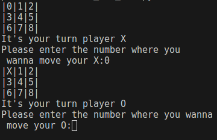
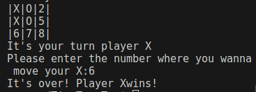

# Tic Tac Toe Game with Python (OOP)
#### This project is a console-based Tic Tac Toe game implemented in Python, following Object-Oriented Programming (OOP) principles to ensure a structured and maintainable codebase.

### Screenshots





## Features:

#### - Classic 3x3 Tic Tac Toe game.
#### - Implemented using Python's OOP concepts.
#### - Clear separation of concerns for game logic and user interface.
#### - Two-player mode: Play against a friend locally.
#### - Winning logic: Detects and announces the winner of the game.
#### - Error handling: Prevents invalid moves and provides user-friendly feedback.


## How to Play

### 1. Clone the repository:

```
git clone https://github.com/abhishekgunkar1/Tic-Tac-Toe.git
```

### 2. Run the game:
```
python tic_tac_toe.py
```


## Usage

#### 1. Run the tic_tac_toe.py script to start the game.
#### 2. Players will take turns to input their moves using the specified format.
#### 3. The game will announce the winner or a draw once the game is over.